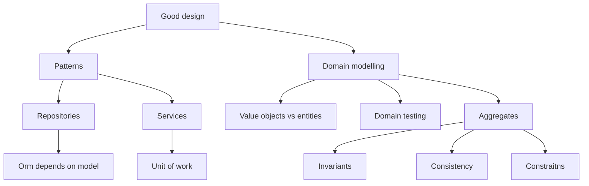
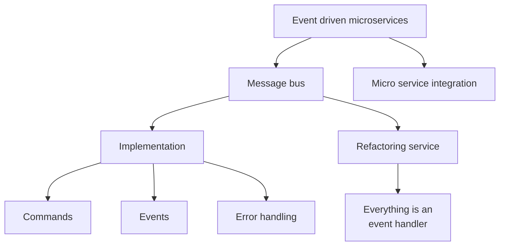

# Architecture Patterns with Python

This repository contains the code used to study the book `Architecture Patterns with Python` by Harry Percival and Bob Gregory.  
Most of my focus is on applying the concepts to my own Django projects but I try to understand the concepts in a more general way too.

## Introduction

Complexity is the enemy of software.
There are 3 tools that can help us fight complexity:

1. **Test Driven Development (TDD)** helps us in writing code that is correct and easy to change.
2. **Domain Driven Design (DDD)**, helps us to focus on the core of the problem
3. **Event Driven Architecture (EDA)**, helps us to decouple our code and software components

It's not easy and clear how to apply these tools in a Django project.

## Index of Arguments

Here there are 2 main mind maps that can be used to organize the arguments of the book. The first is about domain driven design and the second is about event driven microservices. The TDD tool is distributed in each argument.
Mind map of the book arguments first `Domain driven design`:

then `Event driven microservices`:

Arguments with no places in the mind map (for now):

- Summary Diagram and Table
- A Template Project Structure
- Swapping Out the Infrastructure: Do Everything with CSVs
- Repository and Unit of Work Patterns with Django
