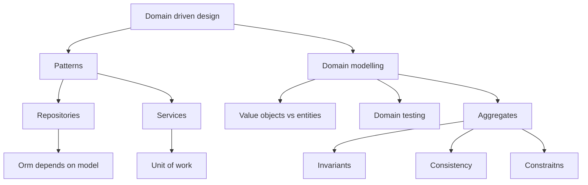

# Architecture Patterns with Python

This repository contains the code used to study the book `Architecture Patterns with Python` by Harry Percival and Bob Gregory.  
Most of my focus is on applying the concepts to my own Django projects but I try to understand the concepts in a more general way too.

## Introduction

Mind map of the book arguments first `Domain driven design`:

then `Event driven microservices`:

Arguments with no places in the mind map (for now):

- Summary Diagram and Table
- A Template Project Structure
- Swapping Out the Infrastructure: Do Everything with CSVs
- Repository and Unit of Work Patterns with Django
