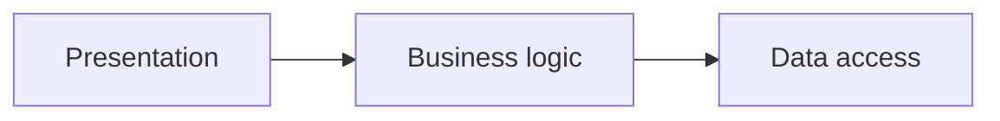

# What can be defined a good design?

Software systems often start with the promise of order but gradually descend into chaos creating a `big ball of mud` of code. Entropy wins and the code becomes complex, unmaintainable and untestable. To avoid this, we can use encapsulation and abstraction:

- **Encapsulation** hides data and simplifies behaviour. It hides the complexity of the implementation and exposes only the essential parts.

- **Abstraction** incapsulates behavior with a task that needs to be done giving it an identity.

> _Encapsulating behavior by using abstractions is a powerful tool for making code more expressive, more testable, and easier to maintain._  
> _Architecture Patterns with Python' by Harry Percival and Bob Gregory_

Using both encapsulation and abstraction can be created a `layered architecture`. Each layer has a specific responsibility and let group each component to a specific layer. The most common layered architecture is the 3 layers architecture, where the layers are

- **Presentation** layer is the interface with the user. It can be a web page, a command line interface or a graphical user interface. It is responsible for receiving the user input and showing the output.

- **Business logic** layer is the core of the application. It contains the domain model and the business rules. It is responsible for the application behavior.

- **Data access** layer is responsible for the data persistence. It can be a database, a file or a remote service.

What is the best way to organize the code in these layers? The answer is the `Dependency Inversion Principle` (DIP). It is a principle of `SOLID` that states that:

- High level modules should not depend on low level modules. Both should depend on abstractions.
- Abstractions should not depend on details. Details should depend on abstractions.

DIP means that the code should not depend on techical details but on the abstractions so that the code can be easily changed if the domain and the business logic needs it.

## Conclusions

In conclusion, a good design is a design that is easy to change and maintain with no or little effort. To achieve this, we can use the `Dependency Inversion Principle` (DIP) to decouple the code from the technical details and the `layered architecture` to organize the code in layers with a specific responsibility. The folder [patterns](./patterns) gives the main patterns that can be used to achieve a good design.
