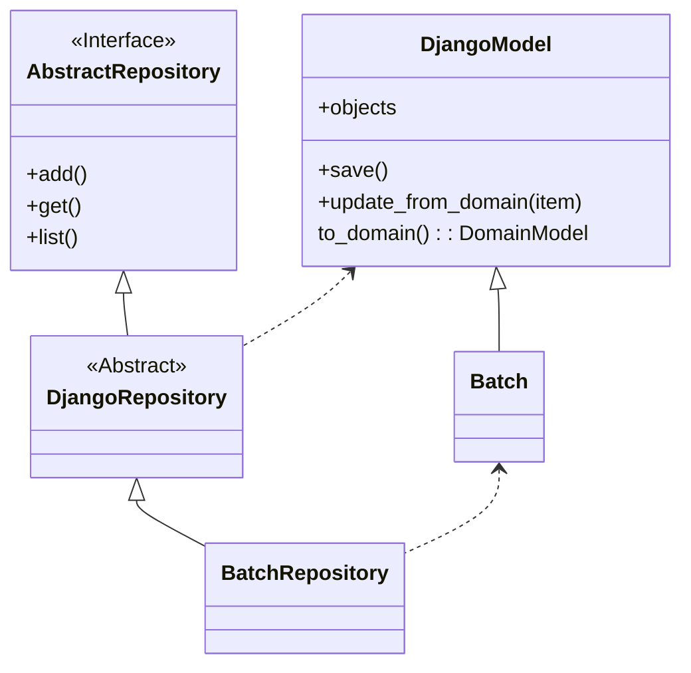

## Repository

Modeling the domain entities is not enough. We need to persist the data in a database or in a file. The repository pattern is a way to abstract the persistent storage. It is a way to decouple the domain entities from the persistent storage.

Common frameworks like Django or Flask have their own way to persist data. For example Django uses its `ORM` based on an `Active record pattern`. Django is powerful but it's not domain driven. The main concept is that the orm hides data persistence detailt and provide an interface to get and save data.

This is the class diagram of the repository pattern implemented in Django.
A Django repository is an `Adapter class` that implements the `AbstractRepository` interface. It uses the Django `Model` to persist data. The `Model` is responsible for saving and retrieving data from the database. The `Repository` is responsible for converting the `Model` to a `Domain model` and vice versa.



### Testing with repositories

Using a repository to persist data makes testing easier. The repository can be mocked and the domain entities can be tested without a database.

```python
class FakeRepository(AbstractRepository):
    def __init__(self, items):
        self._items = set(items)

    def add(self, item):
        self._items.add(item)

    def get(self, reference):
        return next((item for item in self._items if item.reference == reference), None)

    def list(self):
        return list(self._items)
```