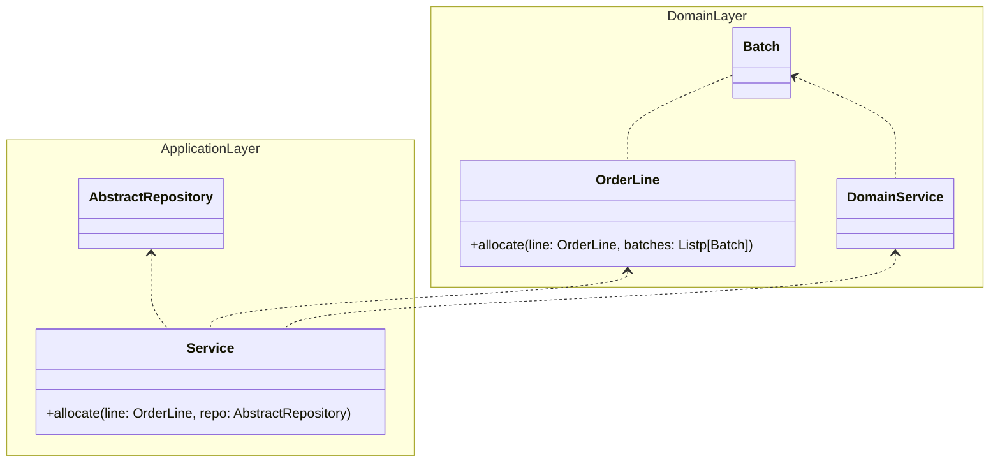

## Service layer

The service layer pattern is a way to organize the code in a layered architecture. It consists in grouping components with a specific `responsibility` in a layer.

In this example there are 2 layers of services: `domain services` and `application services`.
The `domain services` are responsible for the business logic and depends only on `domain models`, the `application services` are responsible for other aspects like using persistence.

