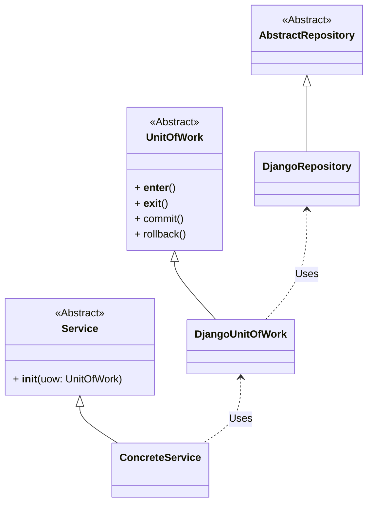

## Unit of work

The unit of work pattern consists in grouping operations that must be executed together or not at all creating `atomic operations`. It's needed to decouple our service layer from the data layer.

The base concept is to create a class that will be responsible for managing the operations that must be executed together and rollback them if one of them fails.
Using Django ORM, the unit of work pattern is implemented by the `transaction.atomic` decorator.

```python
from django.db import transaction

with transaction.atomic():
    # Operations that must be executed together
    pass
```

But if we want to abstract the data layer from the service layer, we need to create our own implementation of the unit of work pattern and implement it with the Django ORM.


